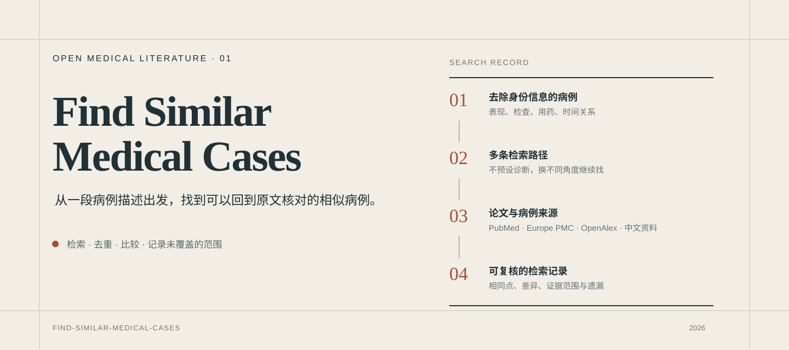
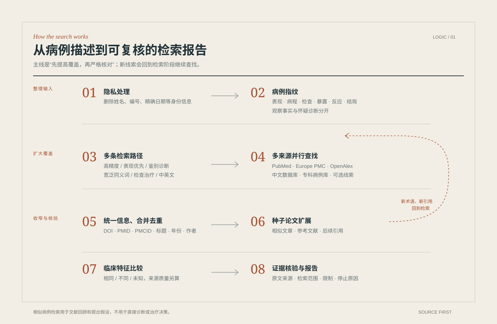
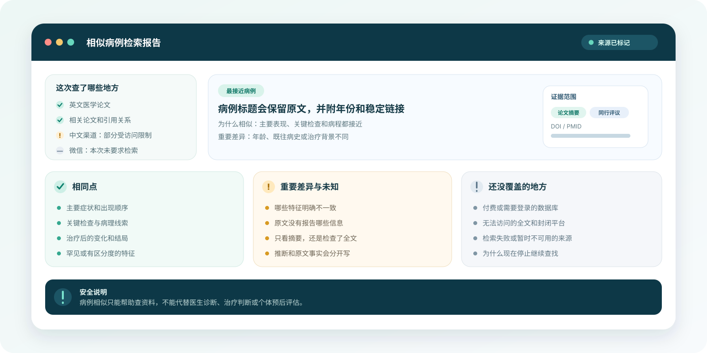

# Find Similar Medical Cases

一个给 Codex 使用的相似医学病例检索 Skill。

查病例时，麻烦的往往不是搜到一篇论文，而是换几种说法继续找、顺着参考文献追下去、排掉重复结果，再判断两份病例究竟像不像。这个项目把这些步骤交给 Codex 完成，最后留下可核对的来源和检索范围。

## 怎么用

先在 Codex 中发送：

> 请安装这个 Skill：https://github.com/JuneYaooo/find-similar-medical-cases

安装完成后，新开一个对话，把已经去除身份信息的病例告诉它：

> 帮我找相似病例：成年患者使用泊沙康唑后出现高血压、低钾、代谢性碱中毒、低肾素和低醛固酮。请说明每篇病例的相同点、差异，以及你实际查过哪些来源。

不需要先整理成专业检索式。年龄范围、症状出现顺序、关键检查、用药或暴露、治疗反应，这些信息比一段完整病历更有用。资料不够时，Codex 会继续问。

完整检索会在当前工作区的 `output` 目录生成一个以去标识化简述和 UTC 时间戳命名的结果包：`search-report.md` 保存总体报告，`search-results.json` 保存可复现的检索账本，`cases/` 为每篇排序后的候选文献保存独立资料页。候选资料页在逐篇核验前不会被标记成独立患者病例。

检索和核验不会为了凑满或不超过某个病例数而提前停止。最终详细展示量可以在病例计划中单独配置，例如设置为 50：患者级核验后不超过 50 个相似病例时全部展示，超过时详细展示排序和代表性更高的 50 个，其余合格病例继续保留在补充清单和机器结果中。这个机制按实际合格病例量触发，不维护写死的“常见病/罕见病”名单。

## 它做了哪些事

- 根据临床表现、检查、用药和时间关系组织不同的查找方式，而不是只搜一个诊断名称。
- 同时查看 PubMed、Europe PMC 和 OpenAlex；需要时再补中文数据库、专科病例库和其他公开来源。
- 从一篇较接近的论文继续查相似文章、参考文献和后续引用。
- 用 DOI、PMID、标题和作者等信息排除重复记录。
- 逐项比较相同点、重要差异和原文没有交代的内容。
- 记录哪些来源查过、哪些受限或失败，以及为什么停止继续查找。

重点不是给出一个看起来精确的“相似度”，而是把判断依据摊开，让人可以回到原文复核。

## 查询逻辑

一句话概括：**先从多个方向尽量找全，再逐条核对和比较。**

这不是让 Codex 看到一个诊断名称后自由搜索。实际工作分成两层：Codex 负责理解病例、补充同义词、决定下一步查什么，以及阅读和比较证据；固定的检索层负责执行查询、记录每次命中、统一文献信息、去重和追踪引用。这样既保留了语言理解能力，也留下了可以复查的检索记录。

### 1. 把病例整理成“病例指纹”

开始检索前，先删除身份信息，再从叙述中留下真正影响查找的内容：年龄范围、主要表现、病程、关键阳性和阴性检查、影像或病理、用药或暴露、治疗反应和结局。

已经观察到的事实和怀疑的诊断会分开记录。这样即使最初的诊断猜错了，也不会把检索带进一个过窄的方向。通常还会挑出 2～6 个最有辨识度的特征，作为后续组合查询的重点。

### 2. 同一病例拆成多条检索路径

一大段完整病历通常搜不好，所以会拆成几组相互独立的查找方式：

- **高精度路径**：罕见表现、特殊检查或药物暴露的组合。
- **表现优先路径**：只看症状、病程和检查，暂时不带诊断名称。
- **诊断与鉴别路径**：分别尝试主要怀疑和可能的替代诊断。
- **宽泛路径**：加入旧病名、缩写、拼写差异和近义词，并保留一次不限定“病例报告”的查找。
- **补充分支**：病理、影像、治疗反应、不良反应，以及需要时的中文表达。

同一篇论文如果被几条不同路径找到，说明它的检索线索比较稳定；这不代表它在临床上一定更相似。

检索计划把同义表达放在同一个概念组中，由程序统一生成“组内 OR、组间 AND”的查询。概念和同义词来自当前病例，不由代码预设某种疾病或药物必须怎么搜；需要使用某个数据库的特殊语法时，仍可以保留自由文本查询。

### 3. 按来源分头查找

PubMed 和 Europe PMC 是英文医学文献的主干。OpenAlex 用来扩大候选范围和寻找引用关系，Crossref 只补 DOI 和出版信息，不用来证明临床事实。中文数据库、专科病例库和微信等渠道按需要加入，并单独标记访问限制和证据类型。

每次查询都会留下来源、查询意图、执行时间、返回数量、这一步新增了多少篇，以及失败或受限原因。“查询失败”和“没有结果”是两件不同的事。

最终结果会把统计口径拆开：计划和实际成功的查询路径、实际调用的来源、查询与来源组合的执行次数、数据库报告的重叠命中、真正返回的记录、去重后的论文候选，以及逐篇核验后确认的患者病例数。论文候选数不会直接写成病例数，因为一篇论文可能包含多位患者，多篇论文也可能描述同一位患者。

### 4. 把各处结果合并并去重

同一篇论文可能同时出现在 PubMed、Europe PMC、OpenAlex 和出版商页面。项目依次参考 DOI、PMID、PMCID、规范化标题、年份和第一作者来合并记录，同时保留它曾经从哪些路径被找到。

如果两个记录的稳定编号互相冲突，即使标题一样也不会直接合并。不同论文还可能描述同一位患者，这类情况会先标记为疑似重复，等待进一步核对。

### 5. 初筛后沿着关键论文继续找

第一轮候选会先检查：它是否真的是病例或病例系列、有没有稳定编号、目前能看到题目、摘要还是全文。然后选出 2～5 篇较接近且身份已经确认的论文作为“种子”。

接下来会查看它们的相似文章、参考文献、后续引用和相关研究。新发现的病名、病理术语或作者线索还会回到前面的检索阶段，形成下一轮查找。很多少见病例正是在这一步被补出来的。

### 6. 逐项判断“像不像”

比较不是只看疾病名称，也不只依赖一个语义分数。目前使用下面这些维度组织复核：

| 比较维度 | 参考权重 | 主要看什么 |
| --- | ---: | --- |
| 罕见或有辨识度的特征 | 20 | 是否出现了最不寻常、最能缩小范围的表现 |
| 主要表现和病程 | 20 | 症状组合、出现顺序和进展方式是否接近 |
| 影像、病理和关键检查 | 20 | 客观证据是否相符 |
| 诊断或最接近的鉴别诊断 | 15 | 最终诊断及排除过程是否相关 |
| 年龄、性别和基础情况 | 10 | 患者背景是否具有可比性 |
| 干预和治疗反应 | 10 | 用药、处置和之后的变化是否接近 |
| 结局和临床场景 | 5 | 随访结局与发生环境是否相近 |

每个维度都要分别写出**相同、不同、未知**。这组权重只帮助安排阅读顺序，不是经过临床验证的诊断概率。病例相似度、文献来源质量和检索可信度始终分开判断。

在人工逐项比较之前，程序可以使用当前检索计划提供的病例特征，对题名和摘要做一轮可解释的初排。特征、同义词和相对权重都随病例定义；原文没有提到的内容保持“未知”，只有计划明确列出的冲突表达才会标记为不匹配。这个初排只决定先读哪篇，不代表临床相似度。

### 7. 检查每条结论有没有原文支持

题目能证明的内容很少，摘要和全文也不能混为一谈。报告会标明一条判断实际来自题目、摘要、全文、教学页面还是二次转述，并尽量回到原始病例。

重要临床结论会和具体来源绑定。如果原文没有提供年龄、检查或结局，就写“未知”，而不是根据常识补全。微信文章或转载可以帮助发现线索，但不能自动获得和原始论文相同的证据地位。

### 8. 判断什么时候可以停止

找到第一篇看起来合适的论文并不算完成。完整流程至少要跑过高精度、表现优先、诊断与鉴别、宽泛同义词四类查询，并对较接近的种子论文做相似文章和引用扩展。

如果连续两次独立查询或扩展，每次新增的合理候选都少于 2 篇，或不足现有候选的 5%，可以认为在已经声明的来源范围内趋于饱和。如果因为访问权限、时间、费用或服务故障而停止，报告会直接写明限制，不会称为“已经找全”。

## 结果是什么样

每条入选病例会保留原文标题、年份和稳定链接，并说明目前核对到了题目、摘要还是全文。病例之间的相同点和差异分开写；没有查到、无法访问和原文未说明，也会分开写。

报告末尾会留下本次检索的范围。它不会把“查了几个常用来源”写成“找到了全部病例”。

## 还可以这样问

> 先不要假设诊断。请从这组临床表现出发查找，并把不同诊断方向分开。

> 除了英文论文，再补充中文病例报告和专科教学病例。不同类型的来源不要混在一起。

> 以这篇论文为起点，继续查它的参考文献、引用它的论文和相似文章：粘贴论文链接。

> 这次只做快速初查。请直接告诉我哪些地方还没查，不要称为完整检索。

## 能查到哪里

英文医学文献以 PubMed 和 Europe PMC 为主，OpenAlex 用来补充发现和引用关系。中文部分可以查找中国知网、万方、维普、SinoMed、CMCR 等入口，也可以按病例类型补充影像、病理、眼科等专科资源。

有些全文和中文数据库需要个人账号或机构订阅。微信文章等内容只能作为线索，关键事实仍应回到论文或机构来源核对。涉及付费来源时，Codex 应先说明费用并征得同意。

## 使用边界

这个 Skill 适合罕见或非典型表现、药物不良反应、特殊治疗反应，以及影像或病理组合的病例回顾。它也适合为病例讨论和研究选题找线索。

它不用于个人诊断、处方、治疗选择或预后判断，也不能代替正式系统综述。病例相似不等于诊断相同，病例报告本身还可能存在信息缺失和选择性发表。

未发表病例、收录延迟、语言差异、访问权限和封闭平台都会造成遗漏，所以这里的“检索完成”只针对报告中列出的范围。

## 隐私

不要发送姓名、联系方式、身份证件、病历号、精确住址、精确就诊日期、带身份信息的检查单或完整病历截图。罕见个人特征组合也可能让患者被识别，应只保留检索所需的临床事实。

即使资料已经去除身份信息，也需要遵守所在机构的隐私、伦理和数据管理要求。

## 项目资料

- [Skill 的完整工作说明](./SKILL.md)
- [来源及使用边界](./references/sources.md)
- [检索流程与停止条件](./references/retrieval-workflow.md)

[MIT License](./LICENSE)
