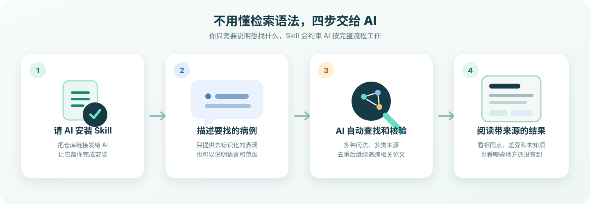

# Find Similar Medical Cases

把一段**已经去除身份信息**的病例描述交给 AI，它会帮你查找相似病例、比较关键异同，并把来源与没有查到的范围一起说明。

不要求你会写医学检索式，也不要求你会编程。你只需要用日常语言说明病例和你关心的问题。

> **重要提醒：**这不是诊断或治疗工具。相似病例只能帮助回顾文献、形成待验证的临床假设，不能单独确定诊断、药物因果关系、治疗方案或个人预后。

## 最简单的使用方法

### 第一步：让 AI 帮你安装

打开支持 Skills 的 AI 助手，推荐使用 Codex。把下面这句话直接发给它：

> 帮我安装 find-similar-medical-cases：https://github.com/JuneYaooo/find-similar-medical-cases

AI 确认安装完成后，重新打开一个对话，让新安装的能力生效。

### 第二步：描述你要找的病例

发送一段已经去除姓名、病历号、联系方式等身份信息的描述。例如：

> 用 find-similar-medical-cases 帮我找相似病例：成年患者使用泊沙康唑后出现高血压、低钾、代谢性碱中毒、低肾素和低醛固酮。

你不必一次把问题说得很完美。AI 会先整理关键表现，再根据缺失信息向你提问。

## 你可以这样问

### 想找最接近的病例

> 帮我找“青年女性、反复低钾、高血压、代谢性碱中毒”的相似病例。请按相似程度排序，并说明每篇病例像在哪里、不同在哪里。

### 不想让 AI 过早认定诊断

> 先不要假设诊断。请同时检索可能表现为这组症状的不同疾病，并把支持和不支持每种可能性的病例分开。

### 想同时补充中文资料

> 除了英文医学论文，再帮我补充中文病例报告和专科教学病例。请把不同类型的来源分开，不要混在一起。

### 已经找到一篇关键论文，想继续深挖

> 从这篇论文继续查它引用的文献、引用它的论文和相似文章，看看还能发现哪些更接近的病例：粘贴论文链接。

### 只想先快速了解

> 先做一次快速初步查找，给我最接近的结果，同时明确告诉我哪些来源还没有检查。不要把初步结果说成完整检索。

## 它会帮你做什么

| 你关心的问题 | AI 会怎么处理 |
| --- | --- |
| 有没有相似病例？ | 从症状、检查、用药、时间关系、诊断和治疗反应等多个角度寻找，不只搜索一个疾病名称。 |
| 病例到底像在哪里？ | 分别列出相同点、重要差异和原文没有提供的信息。 |
| 一篇关键论文之后还有什么？ | 沿着相似文章、参考文献和后续引用继续查找。 |
| 中文或专科病例会不会漏掉？ | 按需补充中文病例库、病例期刊和专科教学资源。 |
| 同一篇文章会不会重复出现？ | 识别不同来源里的重复记录，并保留更完整、可核验的版本。 |
| 结果可靠吗？ | 区分只看到标题、读到摘要、能够查看全文和实际核验过的内容。 |
| 到底查了多少地方？ | 说明已经检查的来源、受限或失败的来源、停止原因和剩余盲区。 |

## 一份结果大概长这样

AI 给出的不应该只是一串论文标题。它还会解释检索覆盖、相似依据、证据范围和未知信息。

通常会包括：

- **病例摘要**：只保留与检索有关、已经去除身份信息的临床特征。
- **最接近的病例**：标题、年份、可访问的来源链接以及为什么相似。
- **相同点与差异**：症状、检查、暴露、病程、治疗和结局分别比较。
- **证据范围**：哪些结论来自题目、摘要或全文，哪些只是待核验线索。
- **检索覆盖**：查过哪里、哪里访问受限、还有哪些来源没有查。
- **安全说明**：提醒结果不能替代医生判断或正式的循证评价。

## 怎么判断结果是否值得继续看

先看来源链接是否能够追溯到原始论文或机构页面，再看 AI 是否明确写出了病例的相同点、差异和未知信息。

一个可信的结果应该同时回答四件事：

1. **为什么找到它**：哪些临床特征真正相似。
2. **证据看到哪里**：只看到题目、读了摘要，还是核验了全文。
3. **哪里不一样**：年龄、病程、检查、用药或结局有哪些关键差异。
4. **还有什么没查**：哪些数据库、全文或封闭来源本次无法覆盖。

如果结果只给出一个“相似度分数”，却没有解释依据和来源，不建议直接采信。

## 它会从哪里找

- **英文医学文献**：以 PubMed 和 Europe PMC 等医学来源为主。
- **开放学术资料**：用于扩大候选范围，并发现相关论文之间的引用关系。
- **中文病例资料**：按需查找中国知网、万方、维普、SinoMed、CMCR 等入口。
- **专科资源**：补充影像、病理、眼科等领域的病例期刊与教学病例。
- **可选的微信线索**：只作为发现线索，重要临床陈述仍需回到原始论文或机构来源核验。

部分中文数据库、出版商全文和封闭平台可能需要登录、机构订阅或单独授权。本项目不会绕过这些限制，也不会把“无法访问”写成“没有结果”。任何可能产生费用的查询，都应该先得到你的明确同意。

## 适合与不适合的场景

| 适合 | 不适合 |
| --- | --- |
| 罕见病或非典型表现的病例回顾 | 根据相似病例自行诊断 |
| 药物不良反应和特殊治疗反应 | 直接决定用药或治疗方案 |
| 影像、病理等少见组合的文献查找 | 预测某位患者的个人结局 |
| 为病例讨论或科研寻找线索 | 替代医生、药师或多学科团队判断 |
| 从关键论文继续追踪相似研究 | 替代正式系统综述的双人筛选和质量评价 |

## 常见问题

### 我完全不懂编程，可以用吗？

可以。安装和使用都可以通过和 AI 对话完成。你只需要提供仓库链接，并用自然语言描述已经去除身份信息的病例。

### 我应该提供多少病例信息？

优先提供与问题有关的年龄范围、主要表现、关键检查、用药或暴露、时间顺序、治疗反应和结局。不要提供能识别患者身份的内容。

### 它能保证找到所有相似病例吗？

不能。未发表病例、数据库收录延迟、语言差异、订阅限制和封闭平台都会造成遗漏。项目会尽量扩大覆盖，同时诚实报告没有检查或无法访问的范围。

### 为什么 AI 有时会继续问我问题？

年龄、症状出现顺序、关键阴性检查或药物暴露时间，可能直接改变检索方向。补充这些信息通常能减少看似相关但临床上并不相似的结果。

### 中文病例也能查吗？

可以，但部分中文来源需要你自己的账号或机构权限。AI 应该把已核验内容、只有题录的线索和无法访问的内容分别标明。

### 会产生费用吗？

核心的公开文献查找通常不需要额外费用。订阅全文、封闭数据库或可选的第三方来源可能收费；AI 不应在没有说明费用和获得你同意的情况下使用付费渠道。

### 找到的结果可以直接用于医疗决策吗？

不可以。病例报告容易受到选择性发表、信息缺失和偶然性的影响。结果应由具备相应资质的专业人员结合指南、更高等级证据和患者实际情况判断。

## 隐私与医疗安全

在把病例发送给任何 AI 或外部检索来源之前，请删除：

- 姓名、电话、邮箱、身份证件和病历号。
- 精确住址、精确就诊日期和其他可定位个人的信息。
- 面部照片、带身份信息的检查单或完整病历截图。
- 不必要且可能组合识别患者的罕见个人特征。

尽量只提供检索所必需的临床事实。即使病例已经去除身份信息，也应遵守所在机构的隐私、伦理和数据管理要求。

## 进一步了解

如果你希望了解项目如何组织检索、区分来源和约束输出，可以阅读：

- [完整工作方式](./SKILL.md)
- [信息来源与使用边界](./references/sources.md)
- [检索质量与停止条件](./references/retrieval-workflow.md)

本项目采用 [MIT License](./LICENSE) 开源。
